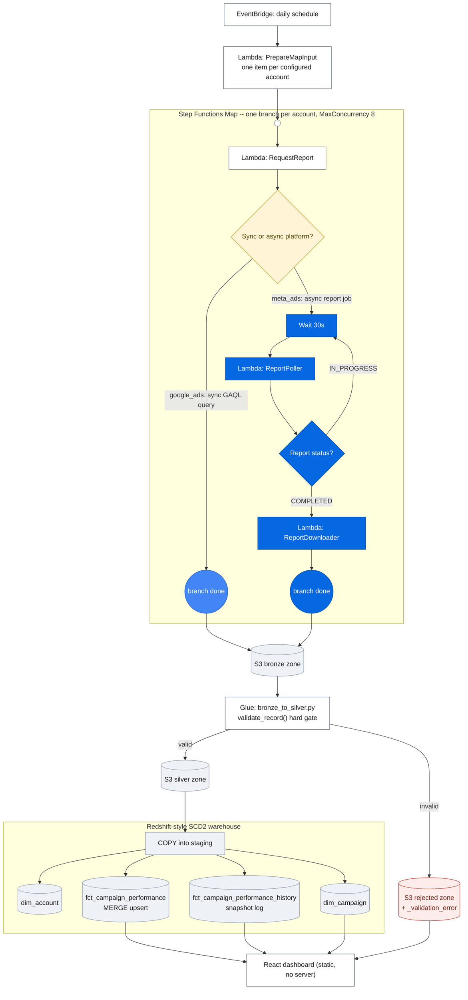

# Google Ads & Meta Ads Pipeline

A demo ad-reporting data pipeline for Google Ads and Meta Ads, architected the same
way as the [Amazon Ads Pipeline](../AD%20Platform%20Pipeline) this project is modeled
on: connectors → Step Functions-orchestrated Lambdas → an S3 medallion lake →
Glue-based validation → a Redshift SCD2 warehouse. A static React dashboard reads the
warehouse's output directly (no backend server) to visualize the result.

**Nothing here is deployed to AWS.** This is a local, runnable stand-in for the real
architecture — see [Scope](#scope-vs-the-amazon-ads-reference-pipeline) below for
exactly what was cut and why.

## Running it

```bash
python3 -m venv .venv && source .venv/bin/activate
pip install -r requirements.txt -r requirements-dev.txt

python -m local_runner.run_pipeline --reset --days 14
```

This regenerates seed data, runs Glue-style validation, snapshots the warehouse before
each of two simulated daily load passes, and writes the dashboard's JSON data files.
Expect output like:

```
Logging to stdout and logs/pipeline_run_20260717T051523Z.jsonl
seed: wrote 168 bronze rows across 4 accounts
glue: 163 valid / 5 rejected
reconciliation 2026-07-03..2026-07-09: OK (83 staging rows == 83 fact rows, $27,287.76 == $27,287.76)
reconciliation 2026-07-10..2026-07-16: OK (80 staging rows == 80 fact rows, $25,876.83 == $25,876.83)
```

Then run the dashboard:

```bash
cd dashboard
npm install
npm run dev       # http://localhost:5173, reads dashboard/public/data/*.json
```

Run the test suite and lint:

```bash
pytest tests/ -v
ruff check .
```

## Architecture



**Legend:** amber diamond = branch decision · blue = Google Ads' synchronous path ·
darker blue = Meta Ads' async create/poll/download path · gray = S3 zone or warehouse
table · red = rejected records.

A polished, standalone render of this same diagram (useful for a presentation or
interview) is available as a self-contained page — see `docs/architecture.html`, or
open it directly in a browser.

The single Map state is what makes this "one pipeline, platform as a fan-out
dimension" rather than one state machine per ad platform — `IsAsyncPlatform` (keyed
on `RequestReport`'s `status` field) is the only place the two platforms' fetch
shapes actually diverge in the orchestration.

### Why Google Ads and Meta Ads don't share one fetch interface

Google Ads' API (`connectors/google_ads_connector.py`) is a synchronous, paginated
GAQL query — rows come back in the same request/response cycle. Meta Ads'
(`connectors/meta_ads_connector.py`) is a genuine async report job: create → poll →
download, exactly like the Amazon Ads reference pipeline's connector. Forcing both
into one abstract base class would mean one of them implements no-op stubs for
methods that don't apply. Instead, both only share
`connectors/base.py`'s `RetryableSession` — retry/backoff on 429/5xx is genuinely
identical across platforms; the fetch shape is not. The state machine's
`IsAsyncPlatform` Choice state (keyed on `RequestReport`'s `status` field) is what
lets a single Map iterator handle both shapes side by side.

### SCD2 in SQLite

`local_runner/run_pipeline.py` is a local stand-in for Redshift Serverless — nothing
here is actually deployed. It re-implements the same SCD2 semantics the `redshift/*.sql`
scripts define (`dim_account`, `dim_campaign` close+insert; `fct_campaign_performance`
MERGE upsert; `fct_campaign_performance_history` full snapshot log), translated to
SQLite: `IS DISTINCT FROM` → `IS NOT`, `MERGE` → `INSERT ... ON CONFLICT DO UPDATE`,
`IDENTITY(1,1)` → `INTEGER PRIMARY KEY AUTOINCREMENT`.

To prove the SCD2 history is genuine rather than hand-faked, the 14-day demo window
is loaded in **two separate simulated daily runs** (Jul 3–9, then Jul 10–16), split at
a mid-window campaign rename. `dim_campaign`'s version chain for the renamed
campaigns only has two rows because two real load passes ran — not because a fixture
says so. `dashboard/public/data/campaign_history.json` shows the result.

## Alerting, versioning, and logging

Four small additions on top of the core ingest → validate → warehouse path, each a
demo-scale stand-in for something a real AWS deployment gets for free:

- **Teams alerts** (`common/notifications.py`) — fire on a reconciliation `MISMATCH`
  or when a platform's rejected ratio for a run exceeds
  `REJECTED_RATIO_ALERT_THRESHOLD` (10%, see `local_runner/run_pipeline.py`). Gated on
  `TEAMS_WEBHOOK_URL` alone — deliberately *not* on `DEMO_MODE` (see
  `common/secrets.py`), since that flag also stubs out credential resolution and this
  project has no real ad-account credentials to fall back to. With no
  `TEAMS_WEBHOOK_URL` set, the alert is logged instead of posted; a failed POST (bad
  URL, network blip) is also just logged, never raised — a missed notification should
  never fail the pipeline run.

  To wire up a real channel: create an Incoming Webhook in a Teams channel (**⋯ →
  Connectors → Incoming Webhook**), then drop it in a repo-root `.env` (gitignored,
  loaded automatically by `main()` via `python-dotenv`):
  ```
  TEAMS_WEBHOOK_URL=https://your-tenant.webhook.office.com/webhookb2/...
  ```
- **S3 versioning, stood in** (`common/versioning.py`) — every bronze/silver/rejected
  write goes through `write_versioned()`, which archives the object it's about to
  overwrite into a sibling `.versions/` folder first. A real deployment would just
  enable bucket versioning (`aws s3api put-bucket-versioning ... Status=Enabled`) and
  get this for free; there's no bucket here, so a file copy does the same job by hand.
- **Redshift snapshots, stood in** (`snapshot_warehouse()` in
  `local_runner/run_pipeline.py`) — before each of the two simulated daily load
  passes, the SQLite stand-in warehouse is backed up (via SQLite's own backup API, so
  a live connection can never yield a torn copy) into `warehouse/snapshots/`, keeping
  the last `SNAPSHOTS_TO_KEEP` (5). The real equivalent is
  `aws redshift create-cluster-snapshot`.
- **Logging, made durable** (`enable_file_logging()` in `common/logging_config.py`) —
  every run now also writes its structured JSON log lines to
  `logs/pipeline_run_<timestamp>.jsonl`, in addition to stdout — the durable-storage
  role CloudWatch Logs plays for real Lambdas and Glue jobs.
- **Data validation, surfaced** — `glue_jobs/bronze_to_silver.py`'s
  `validate_record()` hard gate and `detect_new_fields()` drift signal already ran on
  every `run_pipeline` invocation; what's new is that `run_glue_transform()` parses
  the rejected-ratio and drift-field metrics back out of that job's own structured
  logs and writes them into `dashboard/public/data/pipeline_run_summary.json`'s
  `data_quality` key, so every run's validation outcome is visible without grepping
  logs.

None of this is wired to a CloudWatch Alarm or SNS topic — see
[Scope](#scope-vs-the-amazon-ads-reference-pipeline) below. The Teams webhook is the
one piece of real, end-to-end alerting this project implements.

## Scope vs. the Amazon Ads reference pipeline

This project intentionally cuts everything the reference pipeline has beyond the core
ingest → validate → warehouse path, to keep it demo-sized:

- **Core pipeline only** — no SAM/CloudFormation, no CloudWatch alarms or paging, no
  disaster-recovery scripts. The `Comment` fields in the ASL JSON describe what a real
  deployment would add (e.g. `BranchFailureCount` metrics), but nothing here actually
  provisions AWS resources.
- **One pipeline, platform as a fan-out dimension** — a single Map state over
  `{platform, account}` items, rather than one state machine per ad platform.
- **A smaller demo dataset** — 2 Google Ads accounts + 2 Meta Ads accounts, 14 days,
  ~168 seed rows total, instead of the reference pipeline's larger account/day volume.
- **DEMO_MODE=1** (default, see `common/secrets.py`) — real Google/Meta OAuth is out of
  scope; credential resolution returns a fixed stub token and the real refresh-token /
  system-user-token functions raise `NotImplementedError` deliberately.
- **SQLite instead of Redshift Serverless** — see above. `local_runner/run_pipeline.py`
  runs the pipeline end-to-end on a laptop with no AWS account.

## Repository layout

| Path | What it is |
|---|---|
| `connectors/` | `base.py` (shared retry/backoff), `google_ads_connector.py`, `meta_ads_connector.py` |
| `lambda_handlers/` | `prepare_map_input.py`, `report_requester.py`, `report_poller.py`, `report_downloader.py` |
| `common/` | `secrets.py`, `scheduling.py`, `s3_paths.py`, `bronze_writer.py`, `logging_config.py`, `notifications.py` (Teams alerting), `versioning.py` (overwrite-preserving writes) |
| `validation/rules.py` | `validate_record()` (hard gate) and `detect_new_fields()` (drift signal) |
| `glue_jobs/bronze_to_silver.py` | Bronze → silver/rejected split, run as a standalone CLI script |
| `statemachine/` | `ads_ingestion.asl.json`, `redshift_load.asl.json` |
| `redshift/` | SCD2 dimension + fact SQL, written for real Redshift syntax |
| `seed_data/` | `generate_seed_data.py`, `campaign_catalog.py` — realistic, seeded-random demo data with a ~3% invalid rate and a ~5% drift rate |
| `local_runner/run_pipeline.py` | Local orchestrator: seed → Glue validation subprocess → warehouse snapshot → SQLite SCD2 load → dashboard JSON export |
| `logs/` | Per-run structured JSON logs (gitignored, see [Alerting, versioning, and logging](#alerting-versioning-and-logging)) |
| `warehouse/snapshots/` | Point-in-time SQLite warehouse backups, one per load pass (gitignored) |
| `dashboard/` | Static React (Vite) dashboard reading `dashboard/public/data/*.json` |
| `tests/` | pytest suite — validation rules, scheduling, connectors, bronze writer, S3 paths, Glue job, lambda integration |
| `.github/workflows/ci.yml` | ruff lint, ASL JSON validation, pytest |
| `docs/architecture.html` | Standalone, offline-renderable version of the diagram above (bundles Mermaid locally) |

## Dashboard

Hand-rolled SVG charts (no charting library) so mark specs, hover/tooltip behavior,
and the categorical palette are fully controlled and validated for colorblind-safe
contrast rather than eyeballed. Panels: daily spend and conversions trends (kept as
two separate one-axis charts, never dual-axis), spend-by-platform breakdown, a
sortable campaign table, the `dim_campaign` SCD2 version-chain viewer, a
rejected-records panel grouped by normalized rejection reason, and per-load-pass
reconciliation status. Supports light/dark mode and per-platform filtering.

```bash
cd dashboard && npm install && npm run dev
```
